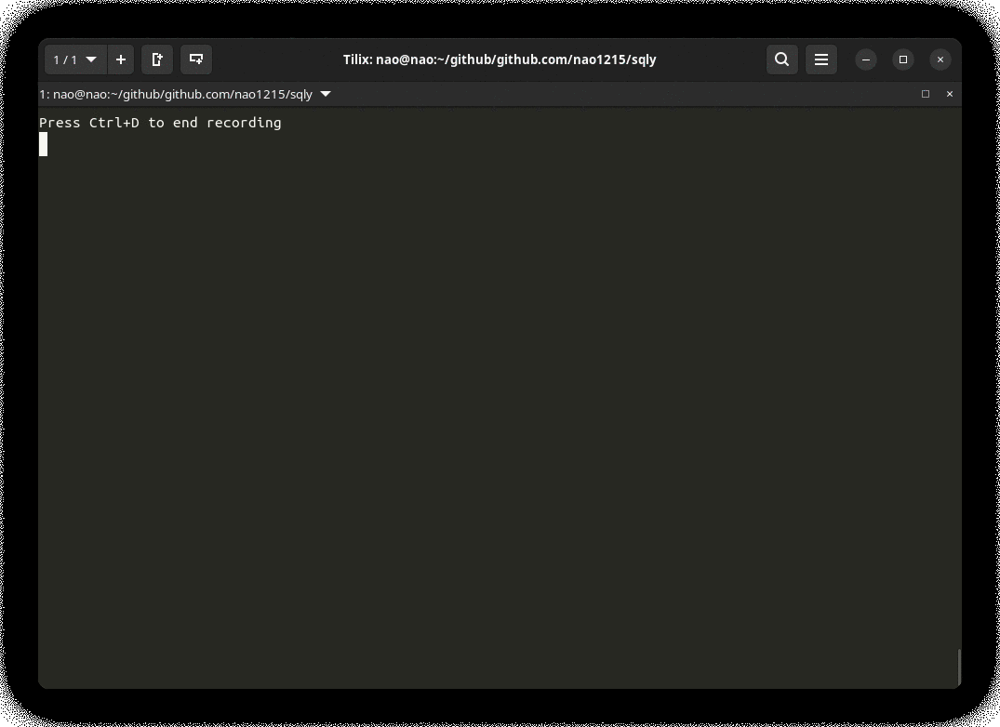

[](https://github.com/nao1215/sqly/actions/workflows/build.yml)
[](https://github.com/nao1215/sqly/actions/workflows/platform_test.yml)
[](https://github.com/nao1215/sqly/actions/workflows/reviewdog.yml)
[](https://goreportcard.com/report/github.com/nao1215/sqly)
  
# sqly - execute SQL against CSV easily 
  

**sqly** command imports CSV file(s) into an in-memory DB and executes SQL against the CSV. sqly uses [SQLite3](https://www.sqlite.org/index.html) as its DB. So, sql syntax is same as SQLite3.  

The sqly command has sqly-shell. You can interactively execute SQL. However, DDL such as CREATE, DML such as GRANT, and TCL such as transactions are intentionally not supported; only DML, i.e., "SELECT", "INSERT", "UPDATE", "DELETE", and "EXPLAIN" are supported.

# How to install
### Use "go install"
If you does not have the golang development environment installed on your system, please install golang from the [golang official website](https://go.dev/doc/install).
```
$ go install github.com/mattn/go-sqlite3@latest  ※ required gcc
$ go install github.com/nao1215/sqly@latest
```

# How to use
sqly command automatically imports the CSV file into the DB when you pass a CSV file as an argument. DB table name is the same as the CSV file name (e.g., if you import user.csv, sqly command create the user table)
## --sql option: execute sql in terminal
--sql option takes an SQL statement as an optional argument. 
```
$ sqly --sql 'SELECT * FROM user' testdata/user.csv 
+-----------+------------+------------+-----------+
| user_name | identifier | first_name | last_name |
+-----------+------------+------------+-----------+
| booker12  |          1 | Rachel     | Booker    |
| jenkins46 |          2 | Mary       | Jenkins   |
| smith79   |          3 | Jamie      | Smith     |
+-----------+------------+------------+-----------+
```

## run sqly shell
If the --sql option is not specified, the sqly shell is started. sqly command arguments may or may not specify CSV file(s). The sqly shell functions similarly to a common SQL client (e.g., sqlite3 command or mysql command). sqly shell has helper commands and SQL execution history management.

### sqly helper command
The command beginning with a dot is the sqly helper command; I plan to add more features in the future to make the sqly shell run more comfortably.
```
$ sqly 
sqly v0.0.7 (work in progress)

enter "SQL query" or "sqly command that beginning with a dot".
.help print usage, .exit exit sqly.

sqly> .help                                                                                        
      .dump: dump db table to csv file
      .exit: exit sqly
      .help: print help message
    .import: import csv file(s)
    .tables: print tables
```

## Execute query sample
```
sqly> .tables                                                                                      
+------------+
| TABLE NAME |
+------------+
| user       |
| identifier |
+------------+
sqly> SELECT user_name, position FROM user INNER JOIN identifier ON user.identifier = identifier.id
+-----------+-----------+
| user_name | position  |
+-----------+-----------+
| booker12  | developrt |
| jenkins46 | manager   |
| smith79   | neet      |
+-----------+-----------+
sqly> SELECT * FROM user;                                                                          
+-----------+------------+------------+-----------+
| user_name | identifier | first_name | last_name |
+-----------+------------+------------+-----------+
| booker12  |          1 | Rachel     | Booker    |
| jenkins46 |          2 | Mary       | Jenkins   |
| smith79   |          3 | Jamie      | Smith     |
+-----------+------------+------------+-----------+
sqly> UPDATE user SET user_name = 'nchika' WHERE identifier = '2'                                  
affected is 1 row(s)
sqly> SELECT * FROM user WHERE identifier = '2'                                                    
+-----------+------------+------------+-----------+
| user_name | identifier | first_name | last_name |
+-----------+------------+------------+-----------+
| nchika    |          2 | Mary       | Jenkins   |
+-----------+------------+------------+-----------+
```

# Features to be added
- import json, tsv, swagger
- sqly shell input completion

# Contributing
First off, thanks for taking the time to contribute! ❤️ Contributions are not only related to development. For example, GitHub Star motivates me to develop!  

[](https://star-history.com/#nao1215/sqly&Date)


# Contact
If you would like to send comments such as "find a bug" or "request for additional features" to the developer, please use one of the following contacts.

- [GitHub Issue](https://github.com/nao1215/sqly/issues)

# LICENSE
The sqly project is licensed under the terms of [MIT LICENSE](./LICENSE).

