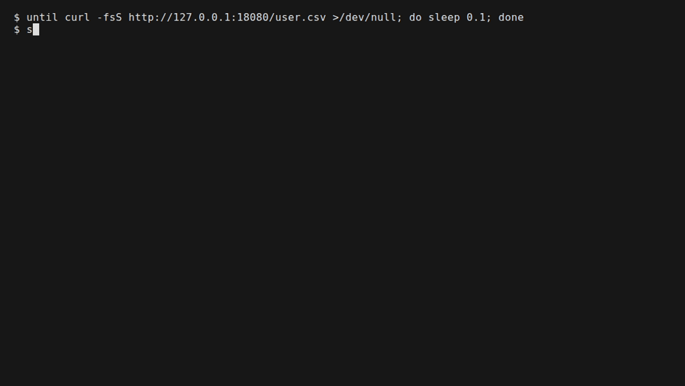
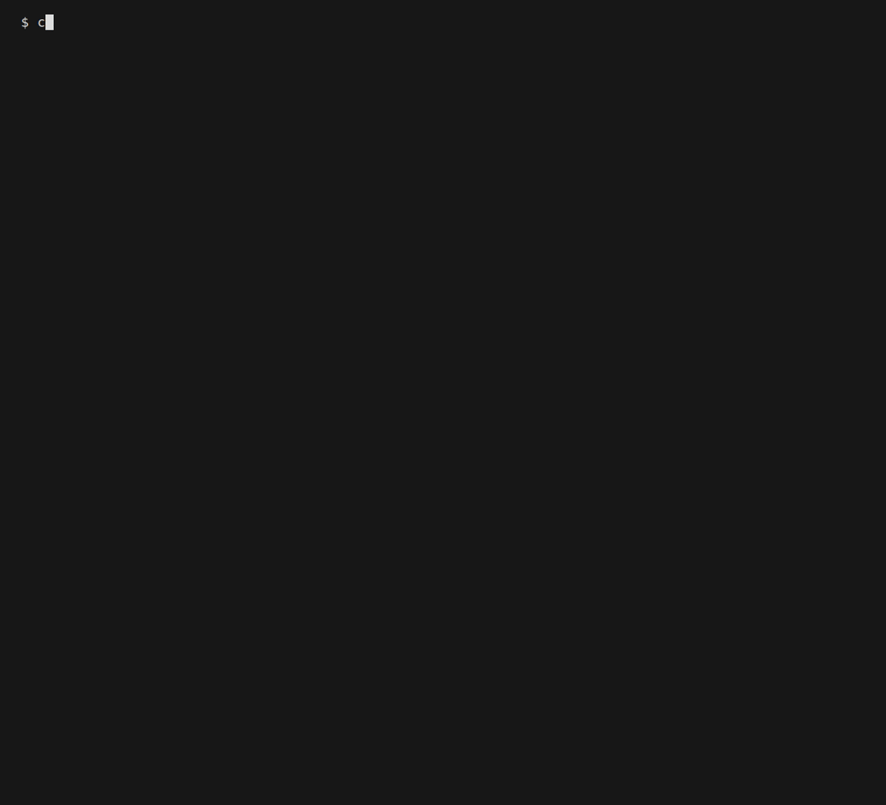
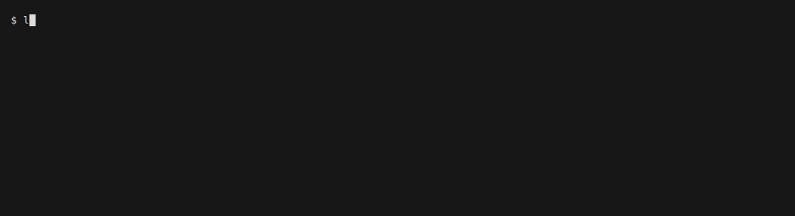

<!-- ALL-CONTRIBUTORS-BADGE:START - Do not remove or modify this section -->
[](#contributors-)
<!-- ALL-CONTRIBUTORS-BADGE:END -->
  

[](https://github.com/nao1215/sqly/actions/workflows/build.yml)
[](https://github.com/nao1215/sqly/actions/workflows/reviewdog.yml)
[](https://goreportcard.com/report/github.com/nao1215/sqly)
  

# sqly

sqly runs SQL against CSV, TSV, LTSV, JSON, JSONL, Parquet, Excel, ACH, and Fedwire files. It imports them into an [SQLite3](https://www.sqlite.org/index.html) in-memory database, so joins, CTEs, and aggregates all work. Compressed files (`.gz`, `.bz2`, `.xz`, `.zst`, `.z`, `.snappy`, `.s2`, `.lz4`) are read transparently.

Run a query directly, or open the interactive shell with completion and history.


```shell
sqly --sql "SELECT * FROM data" data.csv.gz
sqly --sql "SELECT user_name, position FROM user JOIN identifier ON user.identifier = identifier.id" testdata/user.csv testdata/identifier.csv
```

sqly is flag-driven and has no subcommands. Use `sqly --help` and `sqly --version`, not `sqly help` or `sqly version` (those are read as input paths). Helper commands such as `.tables` and `.import` run inside the interactive shell or batch stdin mode, not as command-line arguments.

## Install

```shell
go install github.com/nao1215/sqly@latest
```

```shell
brew install nao1215/tap/sqly
```

Arch Linux users can install the [AUR package](https://aur.archlinux.org/packages/sqly-bin):

```shell
yay -S sqly-bin
```

Without an AUR helper:

```shell
git clone https://aur.archlinux.org/sqly-bin.git
cd sqly-bin
makepkg -si
```

sqly is in the [aqua](https://aquaproj.github.io/) standard registry:

```shell
aqua g -i nao1215/sqly
```

[mise](https://mise.jdx.dev/) can install it through the same registry with the aqua backend:

```shell
mise use aqua:nao1215/sqly
```

Runs on Windows, macOS, and Linux. Requires Go 1.25 or later when building from source.

## Verifying release integrity
Every release ships supply-chain metadata so you can verify what you download:

- Signed checksums: `checksums.txt` is signed with [cosign](https://github.com/sigstore/cosign) (keyless), producing `checksums.txt.sigstore.json`.
- SBOM: an SPDX Software Bill of Materials is attached to each release archive.
- Build provenance: SLSA build provenance is attested via GitHub OIDC.

Verify the signed checksums (then check your archive against `checksums.txt`):

```shell
cosign verify-blob \
  --bundle checksums.txt.sigstore.json \
  --certificate-identity-regexp 'https://github.com/nao1215/sqly/\.github/workflows/release\.yml@refs/tags/.*' \
  --certificate-oidc-issuer 'https://token.actions.githubusercontent.com' \
  checksums.txt
sha256sum --check --ignore-missing checksums.txt
```

Verify the build provenance of a downloaded artifact with the GitHub CLI:

```shell
gh attestation verify sqly_<version>_<os>_<arch>.tar.gz --repo nao1215/sqly
```

## Run SQL: --sql

Pass file or directory paths as arguments; sqly imports each one and names the table after the file (so `user.csv` becomes table `user`).

```shell
$ sqly --sql "SELECT * FROM user" testdata/user.csv
+-----------+------------+------------+-----------+
| user_name | identifier | first_name | last_name |
+-----------+------------+------------+-----------+
| booker12  |          1 | Rachel     | Booker    |
| jenkins46 |          2 | Mary       | Jenkins   |
| smith79   |          3 | Jamie      | Smith     |
+-----------+------------+------------+-----------+
```

sqly can also download a supported file over HTTP or HTTPS before importing it. The same remote URL works both as a CLI input argument and via `.import`, and larger downloads print progress on stderr so they do not look stuck.



```shell
$ python3 -m http.server 8080 --bind 127.0.0.1 --directory testdata
$ sqly --csv --sql "SELECT user_name FROM user ORDER BY identifier LIMIT 2" http://127.0.0.1:8080/user.csv

$ sqly
sqly:~/sqly(table)$ .import http://127.0.0.1:8080/user.csv
sqly:~/sqly(table)$ SELECT COUNT(*) AS c FROM user;
```

## Complex queries

Because every file is loaded into SQLite, the full query engine is available: CTEs, window functions, aggregates, and joins across files of different formats.

Window functions and CTEs (here read from a file with `--sql-file`):



```sql
-- analytics.sql, run with: sqly --sql-file analytics.sql actor.csv
WITH ranked AS (
  SELECT actor, total_gross,
         RANK() OVER (ORDER BY total_gross DESC) AS rank
  FROM actor
)
SELECT rank, actor, total_gross FROM ranked WHERE rank <= 5 ORDER BY rank;

SELECT CASE WHEN number_of_movies >= 50 THEN '50+ movies'
            WHEN number_of_movies >= 35 THEN '35-49 movies'
            ELSE 'under 35' END AS bucket,
       COUNT(*) AS actors, ROUND(AVG(total_gross), 1) AS avg_gross
FROM actor GROUP BY bucket ORDER BY avg_gross DESC;
```

JSON and JSONL rows land in a single `data` column; pull fields out with `json_extract()`:


```shell
$ sqly --sql "SELECT json_extract(data, '$.name') AS name, json_extract(data, '$.age') AS age FROM sample WHERE json_extract(data, '$.age') >= 30 ORDER BY age DESC" testdata/sample.jsonl
```

Formats and compression mix freely. A gzipped CSV is read transparently and joins a plain CSV; a Parquet file is just another table:


```shell
$ sqly --sql "SELECT name, price FROM products ORDER BY CAST(price AS REAL) DESC" testdata/products.parquet
$ sqly --sql "SELECT user_name, position FROM user JOIN identifier ON user.identifier = identifier.id" testdata/user.csv.gz testdata/identifier.csv
```

A JOIN can cross formats directly. Here a Parquet table of products joins a CSV of sales, with revenue computed in the query:


```shell
$ sqly --sql "SELECT p.name, p.price, s.quantity, ROUND(p.price * s.quantity, 2) AS revenue FROM products p JOIN sales s ON p.id = s.product_id ORDER BY revenue DESC" testdata/products.parquet testdata/sales.csv
+----------+--------+----------+---------+
|   name   | price  | quantity | revenue |
+----------+--------+----------+---------+
| Laptop   | 999.99 |        3 | 2999.97 |
| Keyboard |  79.99 |        5 |  399.95 |
| Mouse    |  29.99 |       10 |   299.9 |
+----------+--------+----------+---------+
```

## Interactive shell

Run `sqly` without `--sql` to open the shell. It behaves like `sqlite3` or `mysql`: type SQL, or a helper command that begins with a dot. Tab completes keywords and table names, and history is kept across sessions.

A SQL statement is buffered until it ends with `;`, so a multi-line or pasted query runs as one statement instead of executing each line. Dot-commands are single-line and run on Enter. To run a query without typing `;`, press Enter on a blank line.


```shell
$ sqly testdata/user.csv
sqly v0.27.4

enter "SQL query" or "sqly command that begins with a dot".
.help print usage, .exit exit sqly.

sqly:~/sqly(table)$ .help
        .cd: change directory
     .clear: clear terminal screen
  .describe: print column information of a table
      .dump: dump db table to file in a format according to output mode (default: csv)
      .exit: exit sqly
    .header: print table header
      .help: print help message
    .import: import file(s) and/or directory(ies)
        .ls: print directory contents
      .mode: change output mode
       .pwd: print current working directory
      .save: write tables back to files: .save DIR (to a directory) or .save --force (overwrite sources)
    .schema: print CREATE TABLE statement of a table
    .tables: print tables
```

History is stored in a SQLite database under the config directory. If that location is not writable, sqly disables history for the session with a warning and keeps running. Set `SQLY_HISTORY_DB_PATH` to choose another path.

## Output formats

The default is an ASCII table. Switch with a flag (`--csv`, `--tsv`, `--ltsv`, `--json`, `--ndjson`, `--markdown`), or in the shell with `.mode <name>`. Values are emitted as strings.


```shell
$ sqly --csv --sql "SELECT user_name, identifier FROM user LIMIT 2" testdata/user.csv
user_name,identifier
booker12,1
jenkins46,2

$ sqly --json --sql "SELECT user_name, identifier FROM user LIMIT 2" testdata/user.csv
[
  {"user_name":"booker12","identifier":"1"},
  {"user_name":"jenkins46","identifier":"2"}
]

$ sqly --ndjson --sql "SELECT user_name, identifier FROM user LIMIT 2" testdata/user.csv
{"user_name":"booker12","identifier":"1"}
{"user_name":"jenkins46","identifier":"2"}
```

For automation and ML workflows, `--json-typed` and `--ndjson-typed` emit native JSON scalars instead of strings: a value that is a canonical JSON number becomes a number, `true`/`false` become booleans, and a SQL NULL becomes `null`. A large integer is preserved exactly and never falls back to scientific notation; a value with a leading zero (such as `007`) stays a string. The default `--json`/`--ndjson` keep the string contract for compatibility. The same opt-in applies to the `--inspect` sample rows via `--inspect --json-typed`.

```shell
$ sqly --json-typed --sql "SELECT identifier, user_name FROM user LIMIT 2" testdata/user.csv
[
  {"identifier":1,"user_name":"booker12"},
  {"identifier":2,"user_name":"jenkins46"}
]
```

Excel (`--excel`) and Parquet (`--parquet`) are export-only: they render as CSV on screen and write a real `.xlsx`/`.parquet` file through `--output` or `.dump`. Parquet needs at least one row to infer its schema.

```shell
$ sqly --parquet --output result.parquet --sql "SELECT * FROM user" testdata/user.csv
Output sql result to result.parquet (output mode=parquet)
```

## Write results to a file: --output

Redirection works on Unix; `--output` works everywhere and may appear before or after the file arguments.

```shell
$ sqly --csv --sql "SELECT * FROM user" testdata/user.csv > out.csv
$ sqly --sql "SELECT * FROM user" --output out.csv testdata/user.csv
$ sqly --sql "SELECT * FROM user" testdata/user.csv --output out.csv
```

The format and compression are inferred from the `--output` extension when no mode flag is given (the same applies to `.dump`). Text and JSON formats accept `.gz`, `.xz`, `.zst`, `.z`, `.snappy`, `.s2`, and `.lz4`. A mode flag that disagrees with the extension is rejected, as are `.bz2` and compression on Parquet or Excel.

```shell
$ sqly --sql "SELECT * FROM user" --output result.ndjson.gz testdata/user.csv
```

Because the format is inferred from the extension, `--output` doubles as a converter: query a CSV once and write JSON, Parquet, or Excel. Each result is a normal table you can query again.


```shell
$ sqly --sql "SELECT user_name, identifier FROM user" --output users.json testdata/user.csv
$ sqly --sql "SELECT user_name, identifier FROM user" --output users.parquet testdata/user.csv
$ sqly --sql "SELECT user_name, identifier FROM user" --output users.xlsx testdata/user.csv
```

## Pipe data in: --stdin

Piped stdin is read as commands by default (see batch mode below). Use `--stdin <format>` to treat it as a dataset instead; the format is explicit (`csv`, `tsv`, `ltsv`, `json`, `jsonl`) because a pipe has no filename. The table is `stdin` unless you set `--stdin-name`. Piped data joins file arguments.


```shell
$ cat testdata/user.csv | sqly --stdin csv --sql "SELECT user_name FROM stdin LIMIT 1"
+-----------+
| user_name |
+-----------+
| booker12  |
+-----------+

$ cat testdata/user.csv | sqly --stdin csv --sql "SELECT s.user_name, i.position FROM stdin s JOIN identifier i ON s.identifier = i.id" testdata/identifier.csv
```

## Batch mode

When stdin is not a terminal and `--stdin` is not given, sqly reads SQL and dot commands from it instead of starting the shell. A SQL statement ends at a top-level `;` and may span lines; dot commands are single-line. A failed statement exits non-zero, so batch runs are scriptable.

```shell
$ printf '.tables\nSELECT COUNT(*) FROM user\n' | sqly testdata/user.csv
+------------+
| TABLE NAME |
+------------+
| user       |
+------------+
+----------+
| COUNT(*) |
+----------+
|        3 |
+----------+
```

## Load SQL from a file: --sql-file

`--sql-file PATH` runs SQL read from a file (multiple `;`-separated statements allowed). It cannot be combined with `--sql`. Because the query comes from a file, stdin stays free for a dataset:


```shell
$ cat testdata/user.csv | sqly --stdin csv --sql-file doc/vhs/join.sql testdata/identifier.csv
```

where `doc/vhs/join.sql` holds:

```sql
SELECT s.user_name, i.position
FROM stdin s
JOIN identifier i ON s.identifier = i.id
ORDER BY s.identifier;
```

`--sql-file` can also export with `--output` when the script produces exactly one result set, so a saved script works in the same pipelines as `--sql`. Setup statements may run first; the single result is written to the file. A script that yields no result set or more than one is rejected.

```shell
$ sqly --sql-file report.sql --output out.csv data.csv
```

## Inspect tables: --inspect

`--inspect` imports the inputs, prints a JSON report of every table (name, source, columns, row count, sample rows), and exits without the shell. It is the non-interactive equivalent of `.tables` + `.schema` + `.describe`, useful for scripts and LLMs. Import progress goes to stderr, so stdout is JSON only. `--inspect-sample N` sets the sample size (default 5; `0` for schema only).


```shell
$ sqly --inspect --inspect-sample 1 testdata/identifier.csv
{
  "tables": [
    {
      "name": "identifier",
      "source": "testdata/identifier.csv",
      "row_count": 3,
      "columns": [
        {"name": "id", "type": "INTEGER", "nullable": true, "primary_key": false},
        {"name": "position", "type": "TEXT", "nullable": true, "primary_key": false}
      ],
      "sample_rows": [
        {"id": "1", "position": "developrt"}
      ]
    }
  ]
}
```

Use `--inspect-sample 0` for a schema-only report (no `sample_rows`), so a script can read column types without pulling any data:

```shell
$ sqly --inspect --inspect-sample 0 testdata/identifier.csv
```

## Inspect schema: .schema and .describe

```shell
sqly:~/data(table)$ .schema user
CREATE TABLE "user" ("user_name" TEXT, "identifier" INTEGER, "first_name" TEXT, "last_name" TEXT)

sqly:~/data(table)$ .describe user
+-----+------------+---------+---------+------------+----+
| cid |    name    |  type   | notnull | dflt_value | pk |
+-----+------------+---------+---------+------------+----+
|   0 | user_name  | TEXT    |       0 |            |  0 |
|   1 | identifier | INTEGER |       0 |            |  0 |
|   2 | first_name | TEXT    |       0 |            |  0 |
|   3 | last_name  | TEXT    |       0 |            |  0 |
+-----+------------+---------+---------+------------+----+
```

## Write changes back: --save and --save-dir

A session is in-memory only: `UPDATE`/`INSERT`/`DELETE` change the loaded tables but never touch files unless you opt in. `--save-dir DIR` writes each table into DIR (preserving format, compression, and name) and leaves originals untouched. `--save` overwrites the source files in place and requires `--force`. In the shell, `.save DIR` and `.save --force` do the same.


```shell
$ sqly --sql "UPDATE user SET first_name = 'Rachelle' WHERE identifier = 1" --save-dir ./out testdata/user.csv
$ sqly --sql "DELETE FROM user WHERE identifier > 100" --save --force testdata/user.csv
```

Write-back is deliberately strict about what it will touch. `--save` refuses to run without `--force`, and a run whose SQL changes schema (DDL such as `CREATE TABLE ... AS SELECT`) is rejected up front, before any output is written, since only row changes map back to a file:


```shell
$ sqly --sql "UPDATE user SET identifier = identifier + 100" --save testdata/user.csv
--save overwrites source files; pass --force to confirm, or use --save-dir DIR to write elsewhere
$ sqly --sql "CREATE TABLE backup AS SELECT * FROM user" --save-dir ./out testdata/user.csv
--save/--save-dir cannot persist "CREATE TABLE backup AS SELECT * FROM user": ... only INSERT/UPDATE/DELETE on imported tables are saved
```

Tabular tables that map one-to-one to a single CSV, TSV, LTSV, or Parquet source are written individually. ACH and Fedwire sources are reconstructed as a whole: their related tables (for ACH, the file-header, batches, and entries tables) are rewritten together into one valid `.ach`/`.fed` file, and `--save`/`--save-dir` validate that the required companion tables are still present before writing, failing with an explicit error if the set is incomplete. ACH/Fedwire write-back persists in-place `UPDATE`s to existing rows; adding or removing records is not supported by the native format reconstruction. Tables created by SQL, directory imports, and Excel sources are still rejected for write-back with a clear error before anything is written.

```shell
$ sqly --sql "UPDATE payment_entries SET individual_name = 'Updated' WHERE entry_index = 0" --save --force payment.ach
Saved ACH set payment to payment.ach
```

## Reuse imports: --cache

For repeated queries against the same large inputs, `--cache PATH` snapshots the imported tables to a standalone SQLite file. A later run with unchanged inputs reloads from the snapshot instead of re-parsing the source files, which is much faster for big CSVs. The cache key is each input's path, size, and a SHA-256 hash of its contents, so it invalidates automatically when a source changes. `--cache-clear` forces a cold rebuild, and a cache that is unavailable or unwritable falls back to a normal import with a warning rather than failing the query.

```shell
$ sqly --cache ./sqly.cache --sql "SELECT COUNT(*) FROM big" big.csv   # cold: parses and snapshots
$ sqly --cache ./sqly.cache --sql "SELECT COUNT(*) FROM big" big.csv   # warm: reloads the snapshot
```

Caching is skipped for `--stdin` datasets and for ACH/Fedwire inputs. Because the cache key includes a SHA-256 content hash, an in-place edit is detected even when the file's size and modification time are unchanged.

## Profile data quality: --profile

`--profile` prints a machine-readable data-quality report for every imported table, so you can understand unfamiliar data before writing SQL. For each table it reports row and column counts and, per column, null and blank counts, distinct and numeric counts, and safe warnings: a mix of numeric and non-numeric values, null-like placeholder text (`NULL`, `N/A`, ...), and leading or trailing whitespace. JSON is the default; `--profile-format text` prints a human-readable summary. It works for files, directories, stdin datasets, and multi-table imports.

```shell
$ sqly --profile --profile-format text data.csv
table data: 3 rows, 3 columns
  id (INTEGER): nulls=0 blanks=0 distinct=3 numeric=3
  score (TEXT): nulls=0 blanks=1 distinct=2 numeric=1
    warning: mixed numeric and non-numeric values (1 numeric, 1 non-numeric)
```

## Compare two datasets: --compare

`--compare` diffs two imported tables from the command line, without entering the shell. It reports schema differences (columns unique to each side and type changes) and a row-count delta; add `--compare-key COL` to also diff rows by a key column into added, removed, and modified rows. JSON is the default automation contract; `--compare-format text` prints a human-readable summary.

The two tables are the pair you import; use `--compare-tables "left,right"` to choose the pair explicitly (for example two sheets of one Excel file). Errors are explicit for a missing or non-unique key, a missing named table, or an import that did not produce exactly two tables.

```shell
$ sqly --compare --compare-key id revision1.csv revision2.csv
{
  "left": "revision1",
  "right": "revision2",
  "schema": { "equal": true, "left_only_columns": null, "right_only_columns": null, "type_changes": [] },
  "row_count": { "left": 3, "right": 3, "delta": 0 },
  "rows": { "key": "id", "added": [ ... ], "removed": [ ... ], "modified": [ ... ] }
}
```

## Directory import

A directory argument imports every supported file under it recursively, and you can mix files and directories.

```shell
$ sqly ./data_directory
$ sqly file1.csv ./data_directory file2.tsv --sql "SELECT * FROM users"
```

Point sqly at a folder of mixed-format files and join across them in one query:



```shell
$ sqly ./shop --sql "SELECT p.name, s.quantity FROM products p JOIN sales s ON p.id = s.product_id ORDER BY p.name"
```

The shell `.import` command does the same:

```shell
sqly:~/data$ .import ./csv_files
Successfully imported 3 tables from directory ./csv_files: [users products orders]
sqly:~/data$ .import --sheet "Q1 Sales" report.xlsx
```

## ACH files

ACH (`.ach`) files load as several tables for easy querying:

```shell
$ printf '.tables\n' | sqly testdata/ppd-debit.ach
+-----------------------+
|      TABLE NAME       |
+-----------------------+
| ppd_debit_file_header |
| ppd_debit_batches     |
| ppd_debit_entries     |
+-----------------------+

$ sqly --sql "SELECT amount FROM ppd_debit_entries WHERE amount > 10000" testdata/ppd-debit.ach
```

`{filename}_entries` holds the entry detail records. Addenda become `{filename}_addenda`; IAT files add `_iat_batches`, `_iat_entries`, and `_iat_addenda`.

## Fedwire files

Fedwire (`.fed`) files load as a single `{filename}_message` table with all FEDWireMessage fields.

```shell
$ sqly --sql "SELECT * FROM customer_transfer_message" testdata/customer-transfer.fed
```

## Excel sheets

Each Excel sheet becomes a table named `filename_sheetname`. Pick one with `--sheet` using its original name.

```shell
$ sqly data.xlsx --sheet "A test"
```

## Table name rules

Spaces, hyphens, and dots become `_`; other special characters are removed; a name starting with a digit gets a `sheet_` prefix. Excel sheet names are sanitized the same way, with non-ASCII characters removed.

| Input | Table |
|:--|:--|
| `bug-syntax-error.csv` | `bug_syntax_error` |
| `2023-data.csv` | `sheet_2023_data` |
| `data@v2.csv` | `datav2` |
| `data.xlsx` sheet `Café` | `data_Caf` |

## Supported file formats

| Format | Extensions | Notes |
|:--|:--|:--|
| CSV | `.csv` | |
| TSV | `.tsv` | |
| LTSV | `.ltsv` | |
| JSON | `.json` | Stored in a `data` column; query with `json_extract()` |
| JSONL | `.jsonl` | Stored in a `data` column; query with `json_extract()` |
| Parquet | `.parquet` | |
| Excel | `.xlsx` | Each sheet becomes a table |
| ACH | `.ach` | Creates several tables (`_file_header`, `_batches`, `_entries`, `_addenda`) |
| Fedwire | `.fed` | Creates a single `_message` table |

CSV/TSV/LTSV/JSON/JSONL/Parquet/Excel also read these compression extensions: `.gz`, `.bz2`, `.xz`, `.zst`, `.z`, `.snappy`, `.s2`, `.lz4` (e.g. `.csv.gz`, `.tsv.bz2`).

## Handle malformed rows: --import-mode

When a CSV/TSV row has a different number of fields than the header, `--import-mode` (or the `.import-mode` shell command) chooses what happens:

| Policy | Behavior |
|:--|:--|
| `stop` (default) | Fail the import and report the mismatch |
| `skip` | Drop the malformed rows, import the rest |
| `fill` | Pad short rows with blanks, truncate long rows |

```shell
$ sqly --import-mode skip --sql "SELECT * FROM data" data.csv
```

## Key bindings for the shell

|Key|Action|
|:--|:--|
|Ctrl + A / Ctrl + E|Beginning / end of line|
|Ctrl + P / Ctrl + N|Previous / next command|
|Ctrl + F / Ctrl + B|Forward / backward one character|
|Ctrl + D|Delete character under cursor|
|Ctrl + H|Delete character before cursor|
|Ctrl + W|Cut word before cursor|
|Ctrl + K / Ctrl + U|Cut line after / before cursor|
|Ctrl + L|Clear screen|
|TAB|Completion|
|↑ / ↓|Previous / next command|

## Benchmark

`make bench` measures one full run (import the CSV into the in-memory DB, then run the query) over `testdata/benchmark/customers100000.csv` (100,000 rows, 12 columns):

```sql
SELECT * FROM `customers100000` WHERE `Index` BETWEEN 1000 AND 2000 ORDER BY `Index` DESC LIMIT 1000
```

| Records | Columns | Time per op | Memory per op | Allocations per op |
|--------:|--------:|------------:|--------------:|-------------------:|
| 100,000 | 12 | 515 ms | 161 MB | 2.82M |

Measured on an AMD Ryzen 7 5800U, Go 1.25, sqly v0.27.4. Run `make bench` to reproduce on your machine.

## Comparison with similar tools

The same query on the same 100,000-row, 12-column CSV (top 10 countries by row count), best of 5 end-to-end runs (process start, parse, query) on an AMD Ryzen 7 5800U:

| Tool | Time | Reads |
|:--|--:|:--|
| [trdsql](https://github.com/noborus/trdsql) | 0.32s | CSV, LTSV, JSON, TBLN |
| [csvq](https://github.com/mithrandie/csvq) | 0.34s | CSV, TSV, fixed-length, JSON |
| sqly | 0.49s | CSV, TSV, LTSV, JSON, JSONL, Parquet, Excel, ACH, Fedwire (+ compression) |
| [textql](https://github.com/dinedal/textql) | 0.52s | CSV, TSV |

sqly stays in the same sub-second range as the CSV-focused tools while reading the widest set of formats, shipping an interactive shell, and building as a pure-Go binary with no CGO or external SQLite toolchain. Pick the tool that fits the job; sqly optimizes for format breadth and an interactive workflow over raw single-query speed.

## Alternative tools

|Name| Description|
|:--|:--|
|[nao1215/sqluv](https://github.com/nao1215/sqluv)|Simple terminal UI for DBMS and local CSV/TSV/LTSV|
|[harelba/q](https://github.com/harelba/q)|Run SQL directly on delimited files and multi-file sqlite databases|
|[dinedal/textql](https://github.com/dinedal/textql)|Execute SQL against structured text like CSV or TSV|
|[noborus/trdsql](https://github.com/noborus/trdsql)|CLI tool that can execute SQL queries on CSV, LTSV, JSON, YAML and TBLN. Can output to various formats.|
|[mithrandie/csvq](https://github.com/mithrandie/csvq)|SQL-like query language for csv|

## Limitations (not supported)

sqly runs each statement in its own transaction on an in-memory database, so a few SQLite statements are rejected with a clear error rather than failing in confusing ways:

- Explicit transaction control: `BEGIN`, `COMMIT`, `ROLLBACK`, `SAVEPOINT`, `RELEASE`
- `VACUUM` / `VACUUM INTO`, and `ATTACH` / `DETACH DATABASE`
- DCL such as `GRANT` / `REVOKE`

DDL (`CREATE`, `DROP`, `ALTER`, ...) runs against the in-memory tables, but a non-interactive `--save`/`--save-dir` run rejects a schema change up front, since only `INSERT`/`UPDATE`/`DELETE` on an imported table can be written back to a file.

## Contributing

Thanks for taking the time to contribute! See [CONTRIBUTING.md](./CONTRIBUTING.md) for details. Contributions are not only about code; a GitHub Star also motivates development.

[](https://star-history.com/#nao1215/sqly&Date)

## How to develop

See the [developer documentation](https://nao1215.github.io/sqly/). When adding features or fixing bugs, please write unit tests; sqly aims for unit-test coverage across all packages, as the tree map shows. The README demos are recorded with [charmbracelet/vhs](https://github.com/charmbracelet/vhs) from `doc/vhs/*.tape` (regenerate with `make demo`), and their commands are exercised end-to-end by the atago suite in `e2e/atago/` (`make test-e2e`).


If you would like to report a bug or request a feature, please open a [GitHub Issue](https://github.com/nao1215/sqly/issues).

## Libraries used

- [filesql](https://github.com/nao1215/filesql) - SQL database interface for CSV/TSV/LTSV/JSON/JSONL/Parquet/Excel files with automatic type detection and compressed file support
- [prompt](https://github.com/nao1215/prompt) - Powers the interactive shell with SQL completion and command history

## LICENSE

The sqly project is licensed under the terms of [MIT LICENSE](./LICENSE).

## Contributors ✨

Thanks goes to these wonderful people ([emoji key](https://allcontributors.org/docs/en/emoji-key)):

<!-- ALL-CONTRIBUTORS-LIST:START - Do not remove or modify this section -->
<!-- prettier-ignore-start -->
<!-- markdownlint-disable -->
<table>
  <tbody>
    <tr>
      <td align="center" valign="top" width="14.28%"><a href="https://debimate.jp/"><br /><sub><b>CHIKAMATSU Naohiro</b></sub></a><br /><a href="https://github.com/nao1215/sqly/commits?author=nao1215" title="Code">💻</a> <a href="https://github.com/nao1215/sqly/commits?author=nao1215" title="Documentation">📖</a></td>
      <td align="center" valign="top" width="14.28%"><a href="https://github.com/Wozzardman"><br /><sub><b>Wozzardman</b></sub></a><br /><a href="https://github.com/nao1215/sqly/commits?author=Wozzardman" title="Code">💻</a></td>
      <td align="center" valign="top" width="14.28%"><a href="https://github.com/edsilegxrepo"><br /><sub><b>edsilegxrepo</b></sub></a><br /><a href="https://github.com/nao1215/sqly/commits?author=edsilegxrepo" title="Code">💻</a></td>
      <td align="center" valign="top" width="14.28%"><a href="https://github.com/Marukome0743"><br /><sub><b>まるこめ</b></sub></a><br /><a href="https://github.com/nao1215/sqly/commits?author=Marukome0743" title="Code">💻</a></td>
      <td align="center" valign="top" width="14.28%"><a href="https://github.com/jedvardsson"><br /><sub><b>Jon Edvardsson</b></sub></a><br /><a href="https://github.com/nao1215/sqly/issues?q=author%3Ajedvardsson" title="Bug reports">🐛</a></td>
      <td align="center" valign="top" width="14.28%"><a href="https://github.com/jgstew"><br /><sub><b>JGStew</b></sub></a><br /><a href="https://github.com/nao1215/sqly/issues?q=author%3Ajgstew" title="Bug reports">🐛</a></td>
      <td align="center" valign="top" width="14.28%"><a href="https://github.com/ricardoseriani"><br /><sub><b>Ricardo Seriani</b></sub></a><br /><a href="https://github.com/nao1215/sqly/issues?q=author%3Aricardoseriani" title="Bug reports">🐛</a></td>
    </tr>
    <tr>
      <td align="center" valign="top" width="14.28%"><a href="https://github.com/SnowleopardXI"><br /><sub><b>Ephraim Steve Micaiah</b></sub></a><br /><a href="https://github.com/nao1215/sqly/issues?q=author%3ASnowleopardXI" title="Bug reports">🐛</a></td>
    </tr>
  </tbody>
  <tfoot>
    <tr>
      <td align="center" size="13px" colspan="7">
        
          <a href="https://all-contributors.js.org/docs/en/bot/usage">Add your contributions</a>
        </img>
      </td>
    </tr>
  </tfoot>
</table>

<!-- markdownlint-restore -->
<!-- prettier-ignore-end -->

<!-- ALL-CONTRIBUTORS-LIST:END -->

This project follows the [all-contributors](https://github.com/all-contributors/all-contributors) specification. Contributions of any kind welcome!
