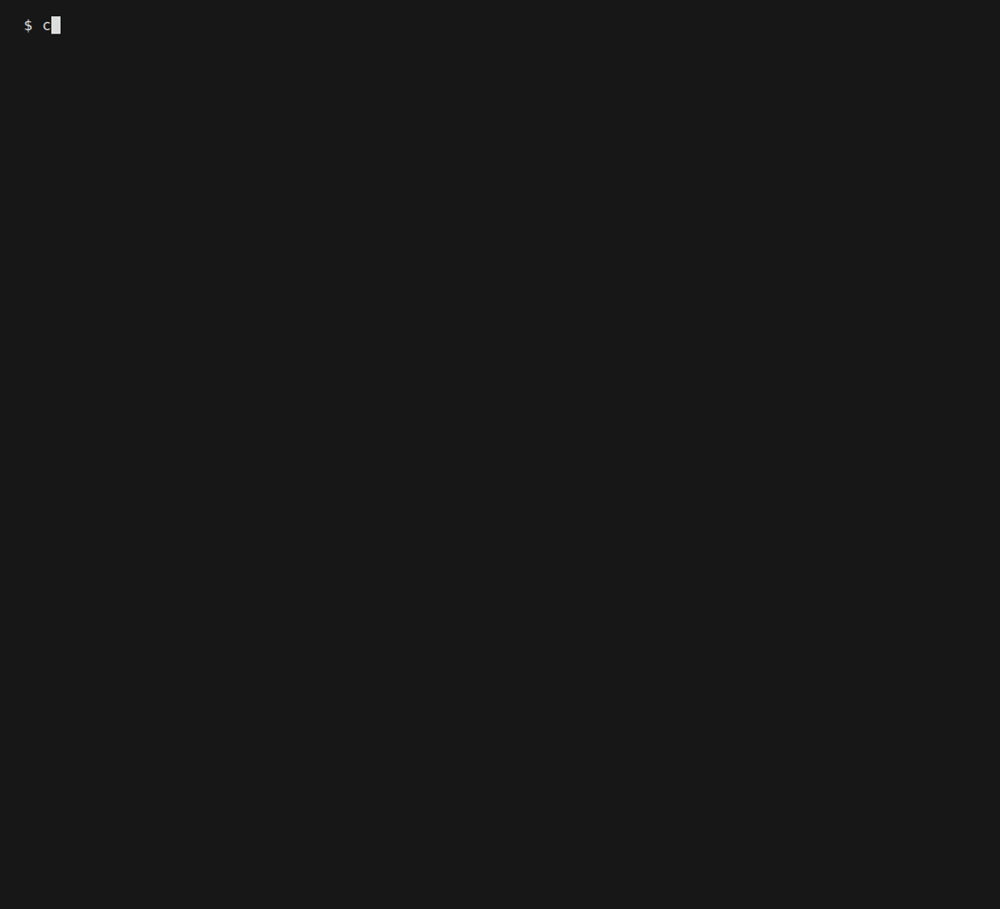

<!-- ALL-CONTRIBUTORS-BADGE:START - Do not remove or modify this section -->
[](#contributors-)
<!-- ALL-CONTRIBUTORS-BADGE:END -->
  

[](https://github.com/nao1215/sqly/actions/workflows/build.yml)
[](https://github.com/nao1215/sqly/actions/workflows/reviewdog.yml)

[](https://github.com/nao1215/sqly/releases)


# sqly

sqly runs SQL against CSV, TSV, LTSV, JSON, JSONL, Parquet, Excel, ACH, and Fedwire files. It loads them into an in-memory SQLite3 database, so joins, CTEs, window functions, and aggregates all work — across formats, in one query. Compressed files (`.gz`, `.bz2`, `.xz`, `.zst`, `.z`, `.snappy`, `.s2`, `.lz4`) are read transparently.

Documentation: **https://nao1215.github.io/sqly/**

This documentation describes `v1.0.0`. It carries substantial breaking changes over v0.x — classified exit codes, visible-only Excel sheets, SIGTERM `143`, multiple inputs as one atomic import, a schema-only `--inspect`, default-deny remote input, stdout carrying nothing but data in every machine-readable format, an export that refuses a value it cannot write rather than changing it, a shell with `.header` removed, `.mode` limited to formats a screen can show, and its history in a text file, and a text input that is not valid UTF-8 refused rather than loaded as mojibake — so read the [CHANGELOG](./CHANGELOG.md) before upgrading.


## Try it in 30 seconds

If you have Go, paste this:

```shell
printf 'name,dept,salary\nalice,eng,120\nbob,sales,90\ncarol,eng,140\n' > staff.csv
go run github.com/nao1215/sqly@latest --sql "SELECT dept, ROUND(AVG(salary)) AS avg FROM staff GROUP BY dept" staff.csv
```

```text
+-------+-----+
| dept  | avg |
+-------+-----+
| eng   | 130 |
| sales |  90 |
+-------+-----+
```

The file is the table: `staff.csv` became `staff`. No schema to declare, no import step.

## Why sqly?

Pick the tool that fits the job:

| You want | Use |
|:--|:--|
| A field-oriented text processor for logs and columns | [awk](https://www.gnu.org/software/gawk/), [Miller](https://miller.readthedocs.io/) |
| A CSV-native SQL dialect with its own engine and cursors | [csvq](https://github.com/mithrandie/csvq) |
| SQL over CSV/TSV/JSON with a choice of backend engines | [trdsql](https://github.com/noborus/trdsql) |
| SQL over CSV with long-standing, mature tooling | [q](https://github.com/harelba/q), [textql](https://github.com/dinedal/textql) |
| SQL over files, with an interactive shell, cross-format joins, and write-back | sqly |

sqly's emphasis is the session: an interactive shell with completion and history, files of different formats joined as peers, and the ability to write edits back into the source file.

## Install

```shell
go install github.com/nao1215/sqly@latest
```

```shell
brew install nao1215/tap/sqly
```

Arch Linux users can install the [AUR package](https://aur.archlinux.org/packages/sqly-bin):

```shell
yay -S sqly-bin
```

sqly is in the [aqua](https://aquaproj.github.io/) standard registry, and [mise](https://mise.jdx.dev/) installs it through the same registry:

```shell
aqua g -i nao1215/sqly
mise use aqua:nao1215/sqly
```

Prebuilt binaries are on the [release page](https://github.com/nao1215/sqly/releases). Runs on Windows, macOS, and Linux; building from source needs Go 1.25 or later. Releases ship cosign-signed checksums, an SPDX SBOM, and SLSA provenance — see [Install](https://nao1215.github.io/sqly/install/) for the verification commands.

## Recipes

### Look at a file you have never seen

`--inspect` prints the tables a file becomes, their columns, and their row counts — as JSON, so `jq` can read it too. It is schema-only: it does not print the data.

```shell
sqly --inspect user.csv
```

```json
{
  "schema_version": 1,
  "sqly_version": "v1.0.0",
  "tables": [
    {
      "name": "user",
      "source": "/home/nao/data/user.csv",
      "row_count": 3,
      "columns": [
        { "name": "user_name",  "type": "TEXT",    "nullable": true, "primary_key": false },
        { "name": "identifier", "type": "INTEGER", "nullable": true, "primary_key": false }
      ],
      "sample_rows": []
    }
  ]
}
```

Add `--inspect-sample N` when you do want rows, and you get at most `N` per table:

```shell
sqly --inspect --inspect-sample 1 user.csv
```

`schema_version` says how to read the document and `sqly_version` says which binary wrote it. The contract, the compatibility policy, and the [JSON Schema](https://nao1215.github.io/sqly/schema/inspect-v1.schema.json) are on the [reference page](https://nao1215.github.io/sqly/reference/#inspect-json-schema).


### Join two files, of any format, in one query

The file is the table, whatever the format: a gzipped CSV and a Parquet file join like two tables in one database.

```shell
sqly --sql "SELECT u.user_name, i.position
            FROM user u JOIN identifier i ON u.identifier = i.id" user.csv.gz identifier.parquet
```

```text
+-----------+-----------+
| user_name | position  |
+-----------+-----------+
| booker12  | developrt |
| jenkins46 | manager   |
| smith79   | neet      |
+-----------+-----------+
```


### Convert between formats

The destination's extension picks the format; `--output-format` names it when the extension cannot.

```shell
sqly --output user.json --sql "SELECT * FROM user" user.csv
sqly --output user.xlsx --sql "SELECT * FROM user" user.csv
```

```text
Output sql result to user.json (output mode=json)
```


### Query JSON and JSONL

A JSON file becomes one table with a `data` column; SQLite's `json_extract()` reaches into it.

```shell
sqly --sql "SELECT json_extract(data, '$.name') AS name,
                   json_extract(data, '$.city') AS city FROM sample" sample.jsonl
```

```text
+---------+--------+
|  name   |  city  |
+---------+--------+
| Alice   | Tokyo  |
| Bob     | Osaka  |
| Charlie | Nagoya |
+---------+--------+
```


### Read a row too wide for the terminal

`--output-format vertical` prints one column per line, in a block per record.

```shell
sqly --output-format vertical --sql "SELECT * FROM actor LIMIT 1" actor.csv
```

```text
-[ RECORD 1 ]-----------------------------------------------
actor             | Harrison Ford
total_gross       | 4871.7
number_of_movies  | 41
average_per_movie | 118.8
best_movie        | Star Wars: The Force Awakens
gross             | 936.7
```

### Pipe the result into another tool

`jsonl` for `jq`, `tsv` for `cut`/`awk`/`sort`. Both write nothing but the rows, so a pipeline stays a pipeline.

```shell
sqly --output-format jsonl --sql "SELECT user_name, identifier FROM user" user.csv | jq -r '.user_name'
sqly --output-format tsv --sql "SELECT status, path FROM logs" logs.csv | cut -f1 | sort -rn | head -n 1
```

```text
{"user_name":"booker12","identifier":1}
{"user_name":"jenkins46","identifier":2}
```

### Load a directory, a URL, or standard input

```shell
sqly ./data --sql "SELECT * FROM users"
sqly --allow-remote --sql "SELECT * FROM user" https://example.com/user.csv
cat user.csv | sqly --stdin-format csv --sql "SELECT COUNT(*) FROM stdin"
```

A URL needs `--allow-remote`: without it sqly refuses the input and makes no HTTP
request at all, so a wrapper that never passes the flag has turned sqly's
downloading off. It is a network capability, not a sandbox or an SSRF defense —
it decides whether a request happens, not where it may go. The download limits,
and what the capability does not protect against, are on the
[formats page](https://nao1215.github.io/sqly/formats/#remote-inputs).


### Rank, window, aggregate

SQLite is the engine, so its whole query language is available — window functions, CTEs, `json_*`, and the rest.

```shell
sqly --sql "SELECT actor, RANK() OVER (ORDER BY total_gross DESC) AS rank FROM actor" actor.csv
```

```text
+-------------------+------+
|       actor       | rank |
+-------------------+------+
| Harrison Ford     |    1 |
| Samuel L. Jackson |    2 |
| Morgan Freeman    |    3 |
+-------------------+------+
```



### Write MySQL, PostgreSQL, or BigQuery syntax

```shell
sqly --dialect postgresql --sql "SELECT user_name, identifier::text FROM \"user\" WHERE user_name ILIKE 'b%'" user.csv
```

`--dialect` is translation, not emulation: constructs with no SQLite equivalent are rejected by name, and SQL that SQLite accepts is passed through, where the answer can differ from the source dialect. The [dialects page](https://nao1215.github.io/sqly/dialects/) lists both, with the divergences sqly knows about.

### Run SQL or a sqly script from a file

```shell
sqly --sql-file examples/report.sql examples/data/sales.csv
sqly --script-file examples/update.sqly examples/data/sales.csv
```

`--sql-file` takes SQL only; a dot-command in it is a usage error. `--script-file`
takes what the shell takes — SQL and dot-commands alike — so it is the one to use
when the script has a side effect such as `.save`. `--script-file` rejects
`--output`; use `.dump` inside the script instead.


Both are runnable in [`examples/`](./examples/), along with `join.sql`, which
answers one query over a CSV and a JSONL at once. The
[reference](https://nao1215.github.io/sqly/reference/) compares the script flags
in full and the [cookbook](https://nao1215.github.io/sqly/cookbook/) has more.

## The shell

`sqly` with no `--sql` opens a REPL: tab completion for keywords, tables, columns, and paths, history across sessions, and dot-commands for everything SQL has no syntax for.


```text
sqly:~/data(table)$ .import user.csv
sqly:~/data(table)$ SELECT user_name FROM user
   ...> WHERE identifier = 1;
sqly:~/data(table)$ .mode json
sqly:~/data(json)$ .save ./out
```

`.help` lists every command; the [shell page](https://nao1215.github.io/sqly/shell/) documents them.

## Write changes back

A session is in-memory only. `.save` writes the tables the session changed back
out — in the shell, or in a script piped to sqly:


```shell
printf "UPDATE user SET first_name = 'Rachelle' WHERE identifier = 1;\n.save ./out\n" | sqly user.csv
```

`.save DIR` writes copies into `DIR` and leaves the sources alone; `.save
--in-place` overwrites them. Format and compression are preserved either way,
and an in-place save keeps the source file's permissions; a copy into `DIR` is a
new file and is created `0600`. A table the session did not change is not
rewritten, and a save covering several files is all-or-nothing. See the [shell
page](https://nao1215.github.io/sqly/shell/) for what it can and cannot write.

Writing a *query result* somewhere is a different job, and that one is a flag:
`--output`.

## Formats

| Format | Extensions | Becomes |
|:--|:--|:--|
| CSV / TSV / LTSV | `.csv` `.tsv` `.ltsv` | one table, columns from the header |
| JSON / JSONL | `.json` `.jsonl` | one table with a `data` column; query with `json_extract()` |
| Parquet | `.parquet` | one table |
| Excel | `.xlsx` | one table per sheet, named `file_sheet`; only the sheets the workbook shows, unless `--include-hidden-sheets` |
| ACH | `.ach` | several tables (`_file_header`, `_batches`, `_entries`, `_addenda`) |
| Fedwire | `.fed` | one `_message` table |

Multiple inputs are loaded atomically: if one file cannot be read, none of them are imported and the run exits `3`. See the [cookbook](https://nao1215.github.io/sqly/cookbook/#multiple-files-are-one-import).

All except ACH and Fedwire also read the compression extensions above. Text inputs without a BOM decode as UTF-8, or as Shift-JIS, EUC-JP, ISO-2022-JP, or UTF-16 with `--encoding`. See [Formats](https://nao1215.github.io/sqly/formats/).

## Flags

sqly has no subcommands: `sqly --help`, not `sqly help`. The flags fall into five groups — input, query, output, inspection, and the two meta ones — and `sqly --help` lists them that way. Everything else, including writing changes back, is a dot-command inside the shell, run at the prompt, from a piped script, or from a `--script-file`.

The [reference](https://nao1215.github.io/sqly/reference/) lists every flag and what it applies to, the multi-result rules, the table name rules, and the exit codes.

## Limitations

sqly runs each statement in its own transaction on an in-memory database, so a few SQLite statements are rejected with a clear error rather than failing confusingly:

- Explicit transaction control: `BEGIN`, `COMMIT`, `ROLLBACK`, `SAVEPOINT`, `RELEASE`
- `VACUUM` / `VACUUM INTO`, and `ATTACH` / `DETACH DATABASE`
- DCL such as `GRANT` / `REVOKE`

## Benchmark

A historical measurement from sqly v0.30.0: importing 100,000 rows and querying
them took about half a second, which was the same range as the CSV-focused
tools. It has not been re-measured since and is not a performance guarantee for
the current release. The numbers, the comparison, and the machine they were
measured on are on the [about page](https://nao1215.github.io/sqly/about/#benchmark).

## Contributing

Thanks for taking the time to contribute; see [CONTRIBUTING.md](./CONTRIBUTING.md) and [how to build and test](./doc/build_and_test.md). Contributions are not only about code: a GitHub Star also motivates development.

When adding features or fixing bugs, please write unit tests. The README demos are recorded with [charmbracelet/vhs](https://github.com/charmbracelet/vhs) from `doc/vhs/*.tape` (`make demo`); the commands they show are separately asserted against the real binary by the atago specs in `e2e/atago/` (`make test-e2e`). The documentation site is built from `website/` with `make website`.

Bugs and feature requests go to [GitHub Issues](https://github.com/nao1215/sqly/issues).

## Libraries and tools used

- [filesql](https://github.com/nao1215/filesql) — the `database/sql` driver that loads and writes back every supported file format, and the dialect translation behind `--dialect`
- [prompt](https://github.com/nao1215/prompt) — the line editor behind the interactive shell
- [atago](https://github.com/nao1215/atago) — the end-to-end test runner: it drives the real `sqly` binary, not a mock, from the plain-YAML specs in `e2e/atago/`. `make test-e2e` runs that suite locally, and CI runs it on Linux, macOS, and Windows after installing atago with [setup-atago](https://github.com/nao1215/setup-atago)

## Acknowledgments

sqly is a memorable project for me because it connected me with two GitHub Sponsors.

[Adam Shannon](https://github.com/adamdecaf), who works in the payments industry at Moov, inspired sqly's support for financial file formats such as ACH and Fedwire. [Shoki Hata](https://github.com/sho-hata), a colleague of mine, has actively used both filesql and sqly; feedback from an actual user improved filesql's performance and led to many bug fixes in sqly.

Thank you both for supporting the project as sponsors, and thanks to everyone who has improved sqly through code, documentation, bug reports, and other contributions.

## LICENSE

The sqly project is licensed under the terms of [MIT LICENSE](./LICENSE).

## Contributors ✨

Thanks goes to these wonderful people ([emoji key](https://allcontributors.org/docs/en/emoji-key)):

<!-- ALL-CONTRIBUTORS-LIST:START - Do not remove or modify this section -->
<!-- prettier-ignore-start -->
<!-- markdownlint-disable -->
<table>
  <tbody>
    <tr>
      <td align="center" valign="top" width="14.28%"><a href="https://debimate.jp/"><br /><sub><b>CHIKAMATSU Naohiro</b></sub></a><br /><a href="https://github.com/nao1215/sqly/commits?author=nao1215" title="Code">💻</a> <a href="https://github.com/nao1215/sqly/commits?author=nao1215" title="Documentation">📖</a></td>
      <td align="center" valign="top" width="14.28%"><a href="https://github.com/Wozzardman"><br /><sub><b>Wozzardman</b></sub></a><br /><a href="https://github.com/nao1215/sqly/commits?author=Wozzardman" title="Code">💻</a></td>
      <td align="center" valign="top" width="14.28%"><a href="https://github.com/edsilegxrepo"><br /><sub><b>edsilegxrepo</b></sub></a><br /><a href="https://github.com/nao1215/sqly/commits?author=edsilegxrepo" title="Code">💻</a></td>
      <td align="center" valign="top" width="14.28%"><a href="https://github.com/Marukome0743"><br /><sub><b>まるこめ</b></sub></a><br /><a href="https://github.com/nao1215/sqly/commits?author=Marukome0743" title="Code">💻</a></td>
      <td align="center" valign="top" width="14.28%"><a href="https://github.com/jedvardsson"><br /><sub><b>Jon Edvardsson</b></sub></a><br /><a href="https://github.com/nao1215/sqly/issues?q=author%3Ajedvardsson" title="Bug reports">🐛</a></td>
      <td align="center" valign="top" width="14.28%"><a href="https://github.com/jgstew"><br /><sub><b>JGStew</b></sub></a><br /><a href="https://github.com/nao1215/sqly/issues?q=author%3Ajgstew" title="Bug reports">🐛</a></td>
      <td align="center" valign="top" width="14.28%"><a href="https://github.com/ricardoseriani"><br /><sub><b>Ricardo Seriani</b></sub></a><br /><a href="https://github.com/nao1215/sqly/issues?q=author%3Aricardoseriani" title="Bug reports">🐛</a></td>
    </tr>
    <tr>
      <td align="center" valign="top" width="14.28%"><a href="https://github.com/SnowleopardXI"><br /><sub><b>Ephraim Steve Micaiah</b></sub></a><br /><a href="https://github.com/nao1215/sqly/issues?q=author%3ASnowleopardXI" title="Bug reports">🐛</a></td>
      <td align="center" valign="top" width="14.28%"><a href="https://ashannon.us"><br /><sub><b>Adam Shannon</b></sub></a><br /><a href="#financial-adamdecaf" title="Financial">💵</a> <a href="#ideas-adamdecaf" title="Ideas, Planning, &amp; Feedback">🤔</a></td>
      <td align="center" valign="top" width="14.28%"><a href="https://sho-hata.com"><br /><sub><b>Shoki Hata</b></sub></a><br /><a href="#financial-sho-hata" title="Financial">💵</a> <a href="#ideas-sho-hata" title="Ideas, Planning, &amp; Feedback">🤔</a> <a href="#userTesting-sho-hata" title="User Testing">📓</a></td>
    </tr>
  </tbody>
  <tfoot>
    <tr>
      <td align="center" size="13px" colspan="7">
        
          <a href="https://all-contributors.js.org/docs/en/bot/usage">Add your contributions</a>
        </img>
      </td>
    </tr>
  </tfoot>
</table>

<!-- markdownlint-restore -->
<!-- prettier-ignore-end -->

<!-- ALL-CONTRIBUTORS-LIST:END -->

This project follows the [all-contributors](https://github.com/all-contributors/all-contributors) specification. Contributions of any kind welcome!
