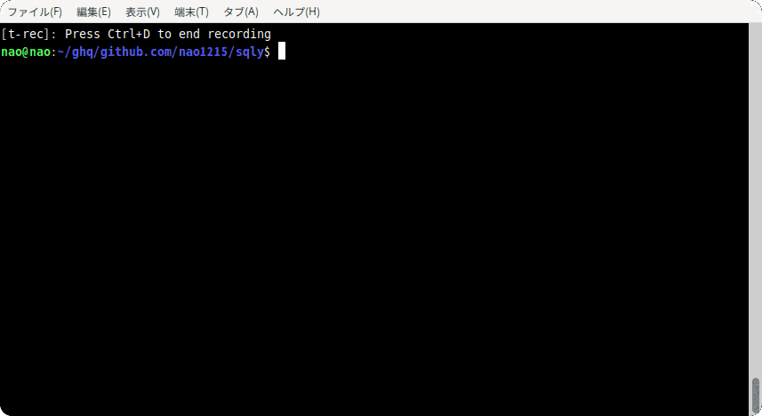
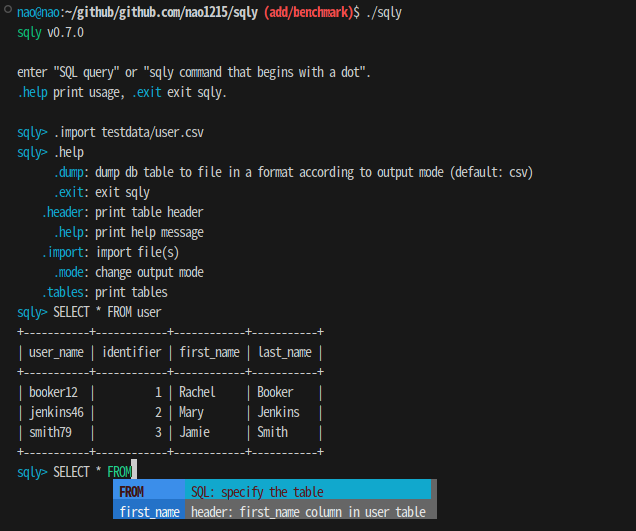

<!-- ALL-CONTRIBUTORS-BADGE:START - Do not remove or modify this section -->
[](#contributors-)
<!-- ALL-CONTRIBUTORS-BADGE:END -->
  

[](https://github.com/nao1215/sqly/actions/workflows/build.yml)
[](https://github.com/nao1215/sqly/actions/workflows/linux_test.yml)
[](https://github.com/nao1215/sqly/actions/workflows/mac_test.yml)
[](https://github.com/nao1215/sqly/actions/workflows/windows.yml)
[](https://github.com/nao1215/sqly/actions/workflows/reviewdog.yml)
[](https://goreportcard.com/report/github.com/nao1215/sqly)
  
  

**sqly** is a powerful command-line tool that can execute SQL against CSV, TSV, LTSV, JSON, and even Microsoft Excel™ files. The sqly import those files into [SQLite3](https://www.sqlite.org/index.html) in-memory database.  

The sqly has **sqly-shell**. You can interactively execute SQL with sql completion and command history. Of course, you can also execute SQL without running the sqly-shell.

> [!WARNING]
> The support for JSON is limited. There is a possibility of discontinuing JSON support in the future.

## How to install
### Use "go install"
```shell
go install github.com/nao1215/sqly@latest
```

### Use homebrew
```shell
brew install nao1215/tap/sqly
```

## Supported OS
- Windows
- macOS
- Linux

## How to use
The sqly automatically imports the CSV/TSV/LTSV/JSON/Excel file into the DB when you pass file path as an argument. DB table name is the same as the file name or sheet name (e.g., if you import user.csv, sqly command create the user table).

The sqly automatically determines the file format from the file extension.

### Syntax and Options
```shell
[Usage]
  sqly [OPTIONS] [FILE_PATH]

[OPTIONS]
  -c, --csv             change output format to csv (default: table)
  -e, --excel           change output format to excel (default: table)
  -j, --json            change output format to json (default: table)
  -l, --ltsv            change output format to ltsv (default: table)
  -m, --markdown        change output format to markdown table (default: table)
  -t, --tsv             change output format to tsv (default: table)
  -S, --sheet string    excel sheet name you want to import
  -s, --sql string      sql query you want to execute
  -o, --output string   destination path for SQL results specified in --sql option
  -h, --help            print help message
  -v, --version         print sqly version
```

※ The sqly option must be specified before the file to be imported.

### Execute sql in terminal: --sql option
--sql option takes an SQL statement as an optional argument.

```shell
$ sqly --sql "SELECT user_name, position FROM user INNER JOIN identifier ON user.identifier = identifier.id" testdata/user.csv testdata/identifier.csv 
+-----------+-----------+
| user_name | position  |
+-----------+-----------+
| booker12  | developrt |
| jenkins46 | manager   |
| smith79   | neet      |
+-----------+-----------+
```

### Change output format
The sqly output sql query results in following formats:
- ASCII table format (default)
- CSV format (--csv option)
- TSV format (--tsv option)
- LTSV format (--ltsv option)
- JSON format (--json option)

```shell
$ sqly --sql "SELECT * FROM user LIMIT 2" --csv testdata/user.csv 
user_name,identifier,first_name,last_name
booker12,1,Rachel,Booker
jenkins46,2,Mary,Jenkins

$ sqly --sql "SELECT * FROM user LIMIT 2" --json testdata/user.csv 
[
   {
      "first_name": "Rachel",
      "identifier": "1",
      "last_name": "Booker",
      "user_name": "booker12"
   },
   {
      "first_name": "Mary",
      "identifier": "2",
      "last_name": "Jenkins",
      "user_name": "jenkins46"
   }
]

$ sqly --sql "SELECT * FROM user LIMIT 2" --json testdata/user.csv > user.json

$ sqly --sql "SELECT * FROM user LIMIT 2" --csv user.json 
first_name,identifier,last_name,user_name
Rachel,1,Booker,booker12
Mary,2,Jenkins,jenkins46
```

### Run sqly shell
  

The sqly-shell starts when you run the sqly command without the --sql option. When you execute sqly command with file path, the sqly-shell starts after importing the file into the SQLite3 in-memory database.  
  
The sqly shell functions similarly to a common SQL client (e.g., `sqlite3` command or `mysql` command). The sqly-shell has helper commands that begin with a dot. The sqly-shell also supports command history, and input completion.  

### Output sql result to file
#### For linux user 
The sqly can save SQL execution results to the file using shell redirection. The --csv option outputs SQL execution results in CSV format instead of table format.
```shell
$ sqly --sql "SELECT * FROM user" --csv testdata/user.csv > test.csv
```

#### For windows user

The sqly can save SQL execution results to the file using the --output option. The --output option specifies the destination path for SQL results specified in the --sql option.

```shell
$ sqly --sql "SELECT * FROM user" --output=test.csv testdata/user.csv 
```

### Key Binding for sqly-shell
|Key Binding	|Description|
|:--|:--|
|Ctrl + A	|Go to the beginning of the line (Home)|
|Ctrl + E	|Go to the end of the line (End)|
|Ctrl + P	|Previous command (Up arrow)|
|Ctrl + N	|Next command (Down arrow)|
|Ctrl + F	|Forward one character|
|Ctrl + B	|Backward one character|
|Ctrl + D	|Delete character under the cursor|
|Ctrl + H	|Delete character before the cursor (Backspace)|
|Ctrl + W	|Cut the word before the cursor to the clipboard|
|Ctrl + K	|Cut the line after the cursor to the clipboard|
|Ctrl + U	|Cut the line before the cursor to the clipboard|
|Ctrl + L	|Clear the screen|  

## Benchmark
CPU: AMD Ryzen 5 3400G with Radeon Vega Graphics  
Execute: 
```sql
SELECT * FROM `table` WHERE `Index` BETWEEN 1000 AND 2000 ORDER BY `Index` DESC LIMIT 1000
```

|Records  | Columns | Time per Operation | Memory Allocated per Operation | Allocations per Operation |
|---------|----|-------------------|--------------------------------|---------------------------|
|100,000|   12|  1715818835 ns/op  |      441387928 B/op   |4967183 allocs/op | 
|1,000,000|   9|   11414332112 ns/op |      2767580080 B/op | 39131122 allocs/op |


## Altenative Tools
|Name| Description|
|:--|:--|
|[harelba/q](https://github.com/harelba/q)|Run SQL directly on delimited files and multi-file sqlite databases|
|[dinedal/textql](https://github.com/dinedal/textql)|Execute SQL against structured text like CSV or TSV|
|[noborus/trdsql](https://github.com/noborus/trdsql)|CLI tool that can execute SQL queries on CSV, LTSV, JSON, YAML and TBLN. Can output to various formats.|
|[mithrandie/csvq](https://github.com/mithrandie/csvq)|SQL-like query language for csv|


## Limitions (Not support)
- DDL such as CREATE
- DML such as GRANT
- TCL such as Transactions

## Contributing
First off, thanks for taking the time to contribute! ❤️ Contributions are not only related to development. For example, GitHub Star motivates me to develop!  

[](https://star-history.com/#nao1215/sqly&Date)

### Contact
If you would like to send comments such as "find a bug" or "request for additional features" to the developer, please use one of the following contacts.

- [GitHub Issue](https://github.com/nao1215/sqly/issues)

### For Developers
When adding new features or fixing bugs, please write unit tests. The sqly is unit tested for all packages as the unit test tree map below shows.


## LICENSE
The sqly project is licensed under the terms of [MIT LICENSE](./LICENSE).

## Contributors ✨

Thanks goes to these wonderful people ([emoji key](https://allcontributors.org/docs/en/emoji-key)):

<!-- ALL-CONTRIBUTORS-LIST:START - Do not remove or modify this section -->
<!-- prettier-ignore-start -->
<!-- markdownlint-disable -->
<table>
  <tbody>
    <tr>
      <td align="center" valign="top" width="14.28%"><a href="https://debimate.jp/"><br /><sub><b>CHIKAMATSU Naohiro</b></sub></a><br /><a href="https://github.com/nao1215/sqly/commits?author=nao1215" title="Code">💻</a> <a href="https://github.com/nao1215/sqly/commits?author=nao1215" title="Documentation">📖</a></td>
    </tr>
  </tbody>
  <tfoot>
    <tr>
      <td align="center" size="13px" colspan="7">
        
          <a href="https://all-contributors.js.org/docs/en/bot/usage">Add your contributions</a>
        </img>
      </td>
    </tr>
  </tfoot>
</table>

<!-- markdownlint-restore -->
<!-- prettier-ignore-end -->

<!-- ALL-CONTRIBUTORS-LIST:END -->

This project follows the [all-contributors](https://github.com/all-contributors/all-contributors) specification. Contributions of any kind welcome!
