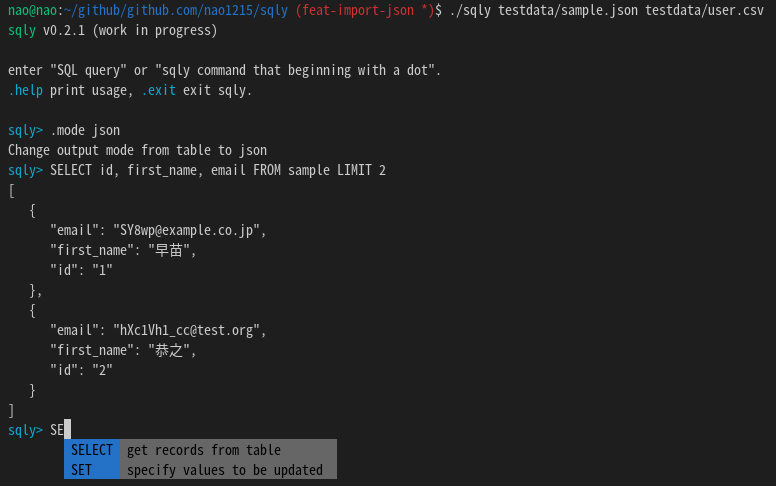

[](https://github.com/nao1215/sqly/actions/workflows/build.yml)
[](https://github.com/nao1215/sqly/actions/workflows/platform_test.yml)
[](https://github.com/nao1215/sqly/actions/workflows/reviewdog.yml)
[](https://goreportcard.com/report/github.com/nao1215/sqly)
  
# execute SQL against CSV/TSV/LTSV/JSON with shell.
  

**sqly** command imports CSV/TSV/LTSV/JSON file(s) into an in-memory DB and executes SQL against the CSV/TSV/LTSV/JSON. sqly uses [SQLite3](https://www.sqlite.org/index.html) as its DB. So, sql syntax is same as SQLite3.  

The sqly command has sqly-shell. You can interactively execute SQL with sql completion and command history. Of course, you can also execute SQL without running the sqly-shell.

# How to install
### Use "go install"
If you does not have the golang development environment installed on your system, please install golang from the [golang official website](https://go.dev/doc/install).
```
$ go install github.com/nao1215/sqly@latest
```
※ Main dependency is [github.com/mattn/go-sqlite3](https://github.com/mattn/go-sqlite3) and gcc.


# How to use
sqly command automatically imports the CSV/TSV/LTSV/JSON file into the DB when you pass a CSV/TSV/LTSV/JSON file as an argument. DB table name is the same as the file name (e.g., if you import user.csv, sqly command create the user table)

## --sql option: execute sql in terminal
--sql option takes an SQL statement as an optional argument. You pass file path(s) as arguments to the sqly command. sqly command import them. sqly command automatically determines the file format from the file extension.
```
$ sqly --sql "SELECT user_name, position FROM user INNER JOIN identifier ON user.identifier = identifier.id" testdata/user.csv testdata/identifier.csv 
+-----------+-----------+
| user_name | position  |
+-----------+-----------+
| booker12  | developrt |
| jenkins46 | manager   |
| smith79   | neet      |
+-----------+-----------+
```

## Change output format
sqly command output sql results in ASCII table format, CSV format (--csv option), TSV format (--tsv option), LTSV format (--ltsv option) and JSON format (--json option). This means that conversion between csv and json is supported.
```
$ sqly --sql "SELECT * FROM user LIMIT 2" --csv testdata/user.csv 
user_name,identifier,first_name,last_name
booker12,1,Rachel,Booker
jenkins46,2,Mary,Jenkins

$ sqly --sql "SELECT * FROM user LIMIT 2" --json testdata/user.csv 
[
   {
      "first_name": "Rachel",
      "identifier": "1",
      "last_name": "Booker",
      "user_name": "booker12"
   },
   {
      "first_name": "Mary",
      "identifier": "2",
      "last_name": "Jenkins",
      "user_name": "jenkins46"
   }
]

$ sqly --sql "SELECT * FROM user LIMIT 2" --json testdata/user.csv > user.json

$ sqly --sql "SELECT * FROM user LIMIT 2" --csv user.json 
first_name,identifier,last_name,user_name
Rachel,1,Booker,booker12
Mary,2,Jenkins,jenkins46
```

## run sqly shell
If the --sql option is not specified, the sqly shell is started. When you execute sqly command, it is optional whether or not to specify file(s). The sqly shell functions similarly to a common SQL client (e.g., sqlite3 command or mysql command). sqly shell has helper commands, SQL execution history management and input complement.

### sqly helper command
The command beginning with a dot is the sqly helper command; I plan to add more features in the future to make the sqly shell run more comfortably.
```
$ sqly 
sqly v0.5.0 (work in progress)

enter "SQL query" or "sqly command that beginning with a dot".
.help print usage, .exit exit sqly.

sqly> .help
      .dump: dump db table to file in a format according to output mode (default: csv)
      .exit: exit sqly
    .header: print table header
      .help: print help message
    .import: import csv file(s)
      .mode: change output mode
    .tables: print tables
```

  

## Output sql result to file
### For linux user 
sqly command can save SQL execution results to a file using shell redirection. The --csv option outputs SQL execution results in CSV format instead of table format.
```
$ sqly --sql "SELECT * FROM user" testdata/user.csv --csv > test.csv
```
### For windows user
 ```
$ sqly --sql "SELECT * FROM user" testdata/user.csv --output=test.csv
```

# All options
```
[OPTIONS]
  -c, --csv             change output format to csv (default: table)
  -h, --help            print help message
  -j, --json            change output format to json (default: table)
  -l, --ltsv            change output format to ltsv (default: table)
  -m, --markdown        change output format to markdown table(default: table)
  -o, --output string   destination path for SQL results specified in --sql option
  -s, --sql string      sql query you want to execute
  -t, --tsv             change output format to tsv (default: table)
  -v, --version         print help message
```

# Key Binding
|Key Binding	|Description|
|:--|:--|
|Ctrl + A	|Go to the beginning of the line (Home)|
|Ctrl + E	|Go to the end of the line (End)|
|Ctrl + P	|Previous command (Up arrow)|
|Ctrl + N	|Next command (Down arrow)|
|Ctrl + F	|Forward one character|
|Ctrl + B	|Backward one character|
|Ctrl + D	|Delete character under the cursor|
|Ctrl + H	|Delete character before the cursor (Backspace)|
|Ctrl + W	|Cut the word before the cursor to the clipboard|
|Ctrl + K	|Cut the line after the cursor to the clipboard|
|Ctrl + U	|Cut the line before the cursor to the clipboard|
|Ctrl + L	|Clear the screen|  
# Features to be added
- [x] import json 
- [x] print json format
- [x] dump json file
- [x] import tsv
- [x] ptint tsv format
- [x] dump tsv file
- [x] import ltsv 
- [x] print ltsv format
- [x] dump ltsv file
- [ ] import excel format (using [qax-os/excelize](https://github.com/qax-os/excelize))
- [ ] import swagger
- [ ] import .gz file
- [x] print markdown format
- [ ] ignore csv header option
- [x] The file type is determined by the file extension. This specification is to reduce the number of options.
- [x] change input position (left arrow, right arrow, delete char)
- [x] sqly Fix problem where multiple lines of input in the shell would cause display corruption. To be fixed using escape sequences.
- [x] input completion (Tab)
- [x] emacs key-bindings (Ctrl-a, Ctrl-e, Ctrl-w)
- [ ] history search (Ctrl-r)
- [ ] Convert CSV character encoding to UTF-8 if necessary
- [ ] Unit test coverage 80%

# Limitions (Not support)
- DDL such as CREATE
- DML such as GRANT
- TCL such as Transactions

# Contributing
First off, thanks for taking the time to contribute! ❤️ Contributions are not only related to development. For example, GitHub Star motivates me to develop!  

[](https://star-history.com/#nao1215/sqly&Date)


# Contact
If you would like to send comments such as "find a bug" or "request for additional features" to the developer, please use one of the following contacts.

- [GitHub Issue](https://github.com/nao1215/sqly/issues)

# LICENSE
The sqly project is licensed under the terms of [MIT LICENSE](./LICENSE).
