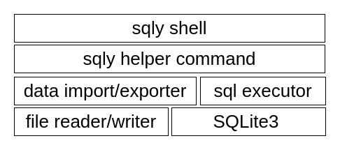
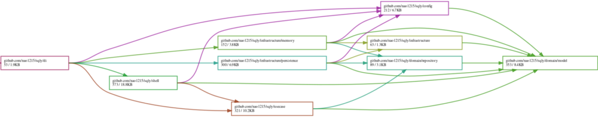
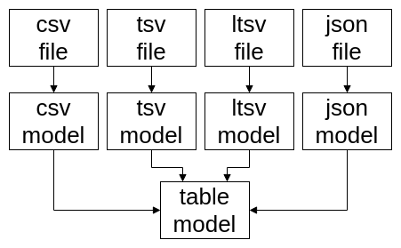

**sqly: A Design Overview**  

sqly operates by reading CSV, TSV, LTSV, and JSON files, inserting the loaded data into an in-memory SQLite3 database, and then executing SQL queries against it.  

The main advantage of this design is that there is no need to implement a custom SQL parser, making development significantly easier (which is crucial). Even if additional file formats are supported in the future, as long as the data insertion process is implemented, no modifications to the SQL parsing logic will be necessary.  

### Block Diagram of sqly  

The following block diagram illustrates the structure of sqly.  

At the user interface level, there is the **sqly shell**, which functions similarly to command-line clients like SQLite or MySQL. To enhance user convenience, helper commands are defined, such as commands for importing files into the database. sqly reads and writes files and executes SQL commands through these helper commands. (This is not entirely accurate, but it conveys the general idea.)  

### Adoption of Domain-Driven Design (DDD)  

sqly adopts **Domain-Driven Design (DDD)** and follows a **layered architecture** to implement it. At first, we considered that a project of sqly’s scale might not necessarily require DDD. However, we ultimately decided to adopt it due to the following advantages:  

- **Reduced test implementation burden**  
  - Test code can be written without inserting data into the database.  
  - That said, since sqly can easily prepare databases using test data files, the benefit is less significant compared to general web service applications.  
- **Easier infrastructure layer (database) modifications**  
  - The system can support not only SQLite3 but also MySQL and PostgreSQL.  
  - However, support for these databases has not yet been implemented.  

### Dependency Analysis with loov/goda  

Using **loov/goda** to analyze dependencies within the sqly package, we can observe that dependencies flow from the left (closer to the UI) to the right (closer to the database), with dependencies accumulating in the **model** package at the far right. Since no package depends on a higher-level layer, the structure appears well-organized.  

### Modeling Approach  

It would be impressive to delve deeply into modeling here, but in sqly, we took a rather straightforward approach. Specifically, we decided that the design would be sufficient as long as it facilitated easy conversion from input data to database table representations.  

Reflecting this simplicity, sqly has two types of models:  

1. **File format-specific models** (e.g., a CSV model corresponding to CSV files).  
2. **A Table model**, which corresponds to a single database table.  

Ultimately, all data is converted into the **Table model** within sqly, keeping the structure simple.  

### A Mistake in the Design  

While drawing a diagram for this transformation process, I realized a mistake. When outputting database table contents to a file, sqly directly converts the **Table model** to each file format. Ideally, the data should first be converted into format-specific models (e.g., a CSV model) before outputting. This oversight highlights the downside of a hasty approach—lesson learned.  

