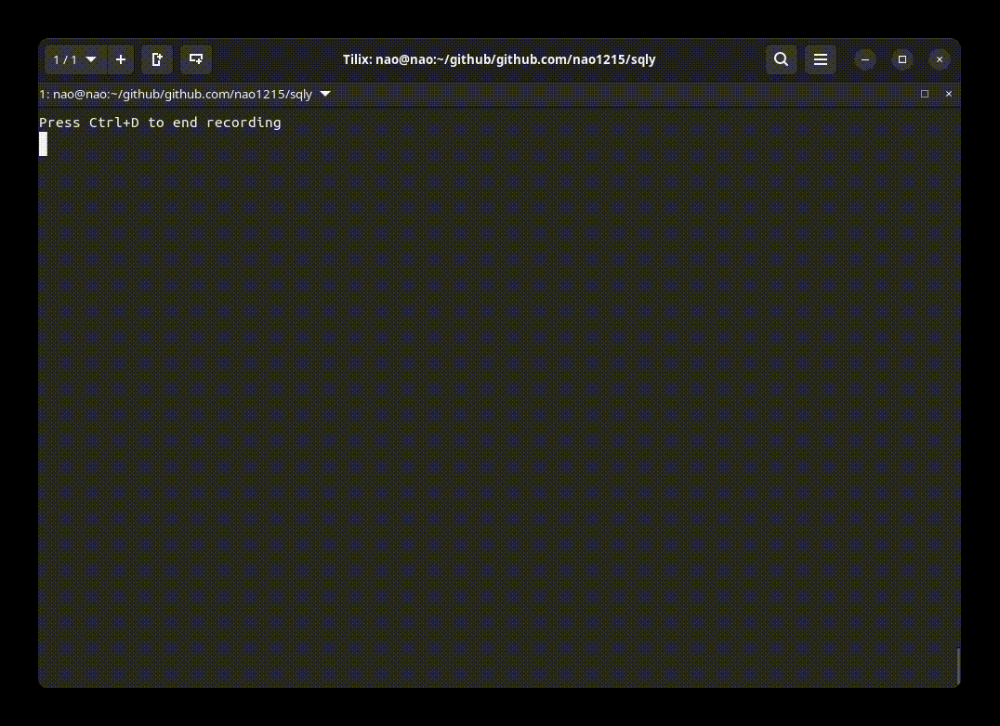

## What is sqly?

The `sqly` command is a command-line tool for executing SQL queries on CSV/TSV/LTSV/JSON files and Microsoft Excel™. `sqly` is written in Golang and supports cross-platform usage. Similar tools include [harelba/q](https://github.com/harelba/q), [dinedal/textql](https://github.com/dinedal/textql), [noborus/trdsql](https://github.com/noborus/trdsql), and [mithrandie/csvq](https://github.com/mithrandie/csvq).

One of the unique strengths of `sqly` is that it allows you to interactively build SQL queries using the `sqly shell`. You can interactively execute SQL with SQL completion and command history. Of course, you can also execute SQL without running the `sqly-shell`. Since `sqly` uses SQLite3 to execute SQL, the SQL syntax is equivalent to SQLite3.

## Document for users

- [Installation](./installation.md)
- [How to use](./how_to_use.md)
- [SQLY shell](./sqly_shell.md)
- [SQLY helper command](./sqly_helper_command.md)
- [Alternative tools](./alternative_tools.md)

## Document for developers

- [How to build & test](./build_and_test.md)
- [Auto-generate files](./auto_generate_files.md)
- [Architecture](./architecture.md)
- [Design Overview](./design_overview.md)

## Topics

- [Why I created sqly](./why_i_created_sqly.md)
- [The origin of the name sqly](./name_origin.md)

## Contributing

If you find a bug or have a feature request, please open an [issue](https://github.com/nao1215/sqly/issues). If you want to contribute, please open a pull request. We welcome contributions from the community. Documentation updates are also.

The sqly project performs quality checks using GitHub Actions. The following items are checked in GitHub Actions:

- Whether it can be built
- Whether tests pass
- Whether auto-generated files are up-to-date
- Whether test coverage exceeds 83%
- Whether it passes multiple linters (e.g., whether it follows architectural rules, whether it has security measures, etc.)

Contributing is not limited to development. Providing a GitHub Star or becoming my [sponsor](https://github.com/sponsors/nao1215) also greatly boosts my motivation for development.

## License

[MIT License](https://github.com/nao1215/sqly/blob/main/LICENSE)
